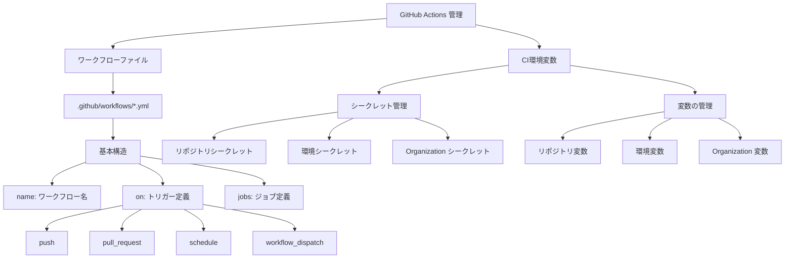
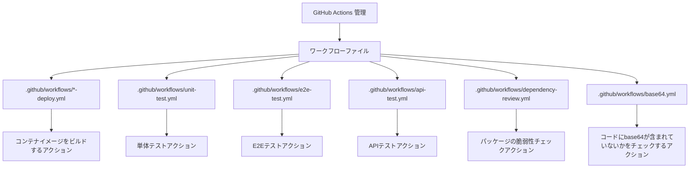
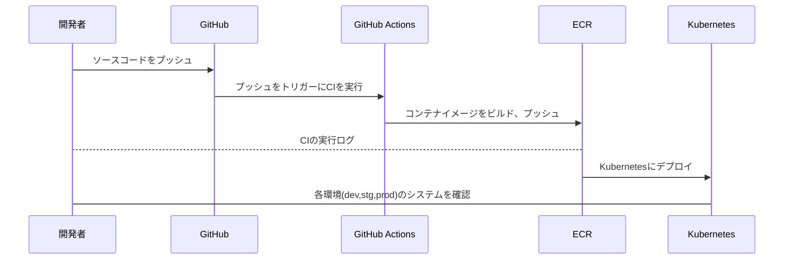
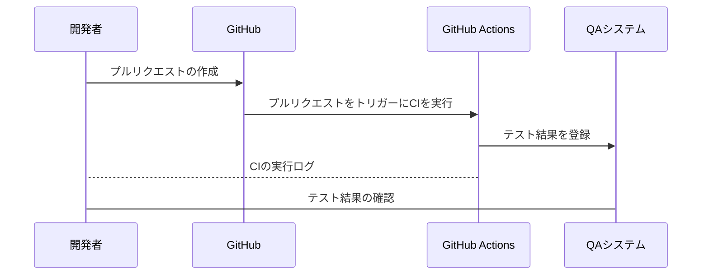
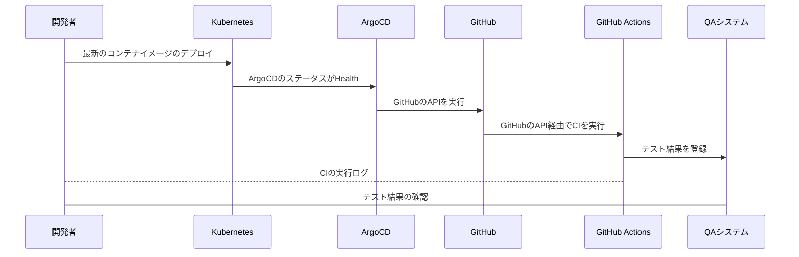

#### GitHubの移行理由
プラン: GitHub Enterprise,Copilot Business

- セキュリティ強化
	- GitHub Advanced Security
		- CodeQL
			- コードの静的解析
		- シークレットスキャン
			- コードに含まれるシークレットの検知
		- Dependency Review
			- 依存関係のあるパッケージの脆弱性のスキャン
- コスト

#### GitLab -> GitHub へのリポジトリ移行

```sh
git clone --mirror {repo url}
cd {プロジェクト}
git remote set-url origin {new repo url}
git push --mirror
```


#### GitLab -> GitHub へのリポジトリ移行に伴う変更点
- CIのファイルの変更
- E2Eテストのコード変更


####  CIのファイルの変更
GitHubでCIを実行したい場合は、`.github/workflows`配下にCIのファイルを配置しています。
GitHubのCIはGitHub Actionsと呼びます。

### GitHub Actions ワークフロー管理のツリーマップ



### GitHub Actions ワークフロー



```yaml
name: CI/CD パイプライン
on:
  push:
    branches: [ main, develop ]
jobs:
  build:
    runs-on: vm-runner
    steps:         
      - name: 依存関係インストール
        run: npm ci
        
      - name: リント実行
        run: npm run lint
        
      - name: テスト実行
        run: npm test
        
      - name: ビルド実行
        run: npm run build
```

##### GitHub Actions (コンテナイメージのビルド)


##### GitHub Actions (単体テスト)


##### GitHub Actions (APIテスト,E2E)



####  E2Eテストのコード変更
GitLab RunnerのCIでのみ使用できる環境変数をGitHub用に変更した。
